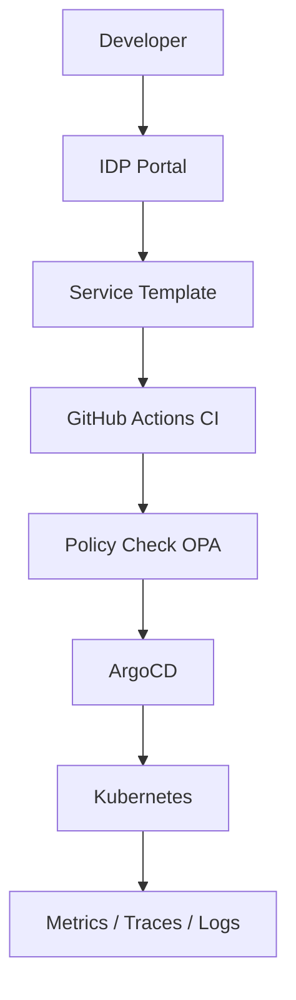

## Problem

Each team was building microservices with different conventions. The variability produced inconsistent pipelines, operational debt, and incomplete security controls.

## Solution

An IDP was built with an internal product mindset:

- service templates (API, worker, consumer)
- standard pipeline with quality gates and security checks
- policy-as-code for deployments and configuration
- service catalog with ownership and runbooks

## Diagram

## Impact

- New service lead time: 5 days → 6 hours
- Configuration failures in production: -63%
- Security standards coverage: 100% of new services
- Technical onboarding: 2 weeks → 3 days
