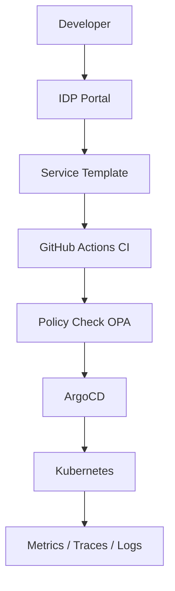

## Problema

Cada equipo creaba microservicios con convenciones distintas. La variabilidad generaba pipelines inconsistentes, deuda operativa y controles de seguridad incompletos.

## Solución

Se construyó una IDP con enfoque de producto interno:

- plantillas de servicio (API, worker, consumer)
- pipeline estándar con quality gates y seguridad
- policy-as-code para despliegues y configuración
- catálogo de servicios con ownership y runbooks

## Diagrama

## Impacto

- lead time de servicio nuevo: 5 días -> 6 horas
- fallas de configuración en producción: -63%
- cobertura de estándares de seguridad: 100% de nuevos servicios
- onboarding técnico: 2 semanas -> 3 días
