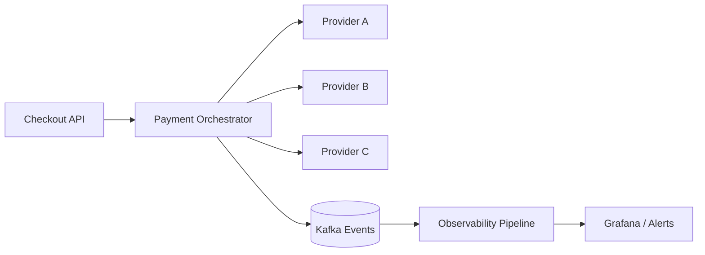

## Problema

El negocio operaba con múltiples proveedores de pago sin una capa de orquestación unificada. El resultado era alto acoplamiento, tiempos de recuperación largos y conciliación manual diaria.

## Solución

Se diseñó una plataforma de orquestación con:

- motor de ruteo por reglas de riesgo/costo/disponibilidad
- contratos unificados para autorización/captura/reversa
- trazabilidad con `trace_id` de extremo a extremo
- métricas SLI/SLO por proveedor y operación

## Diagrama

## Impacto

- éxito de autorización: +4.8%
- MTTR de incidentes de pago: 52 min -> 14 min
- conciliación manual: 4h/día -> 30 min/día
- incidentes repetitivos: -41% en 3 meses
