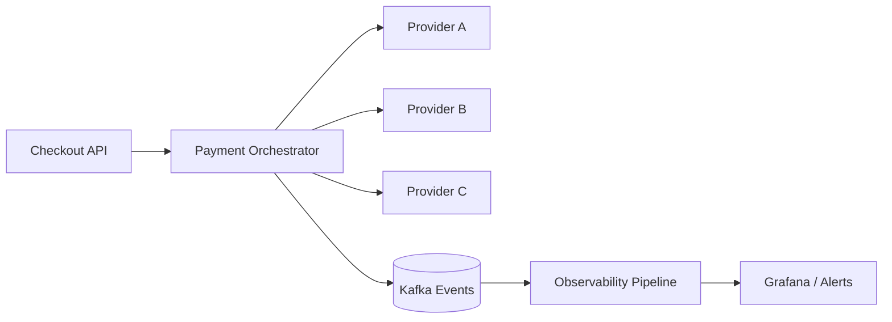

## Problem

The business operated with multiple payment providers and no unified orchestration layer. The result was high coupling, long recovery times, and daily manual reconciliation.

## Solution

An orchestration platform was designed with:

- routing engine based on risk/cost/availability rules
- unified contracts for authorization/capture/reversal
- end-to-end traceability via `trace_id`
- SLI/SLO metrics per provider and operation

## Diagram

## Impact

- Authorization success rate: +4.8%
- MTTR for payment incidents: 52 min → 14 min
- Manual reconciliation: 4h/day → 30 min/day
- Recurring incidents: -41% in 3 months
